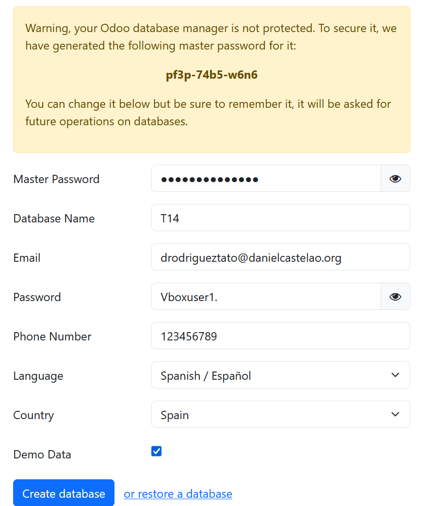
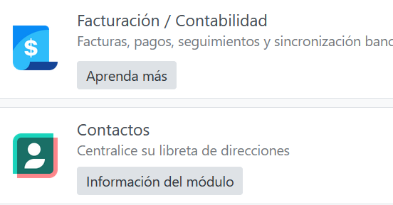
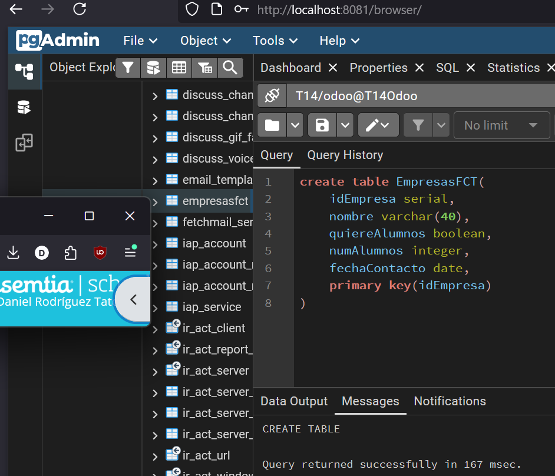
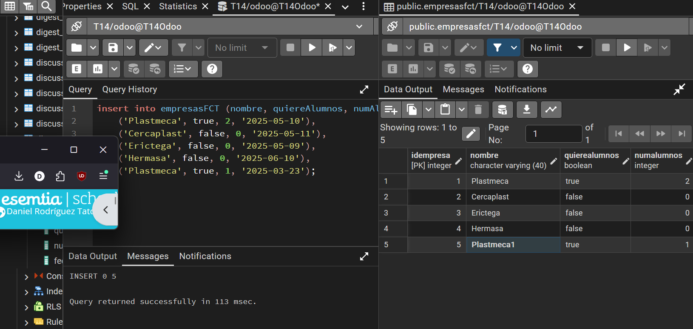
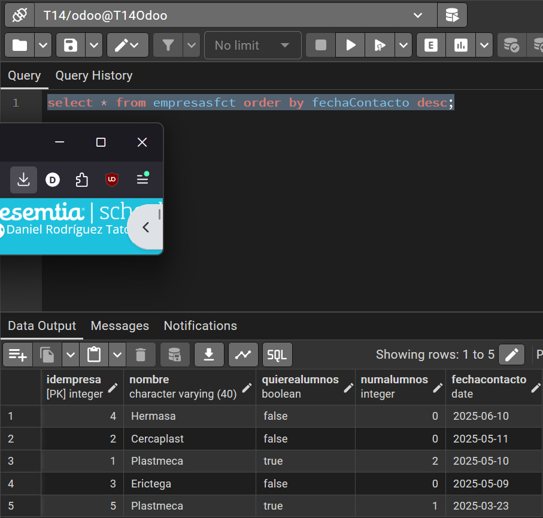
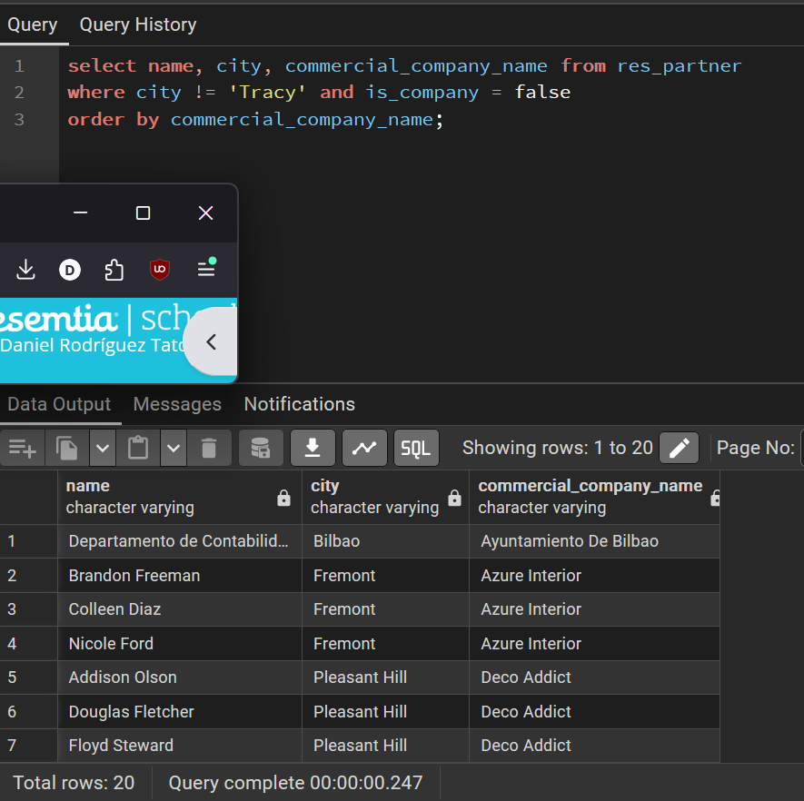
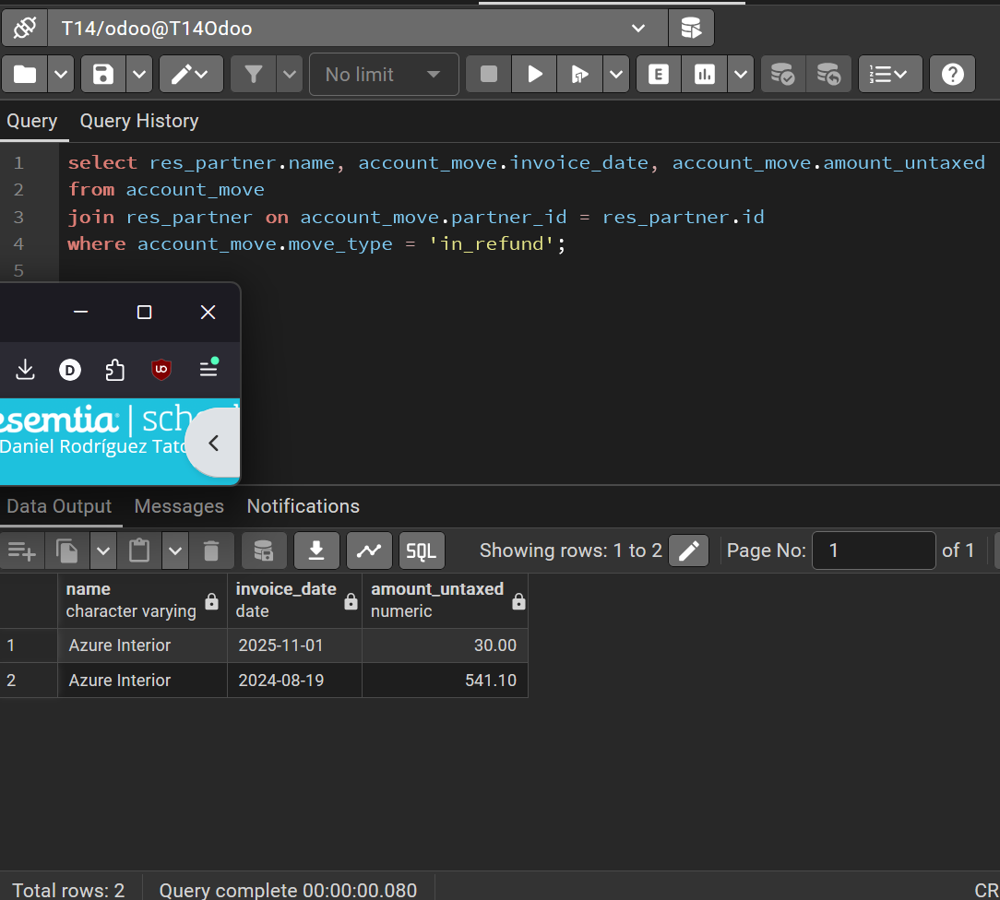

## Creacion de la base de datos e instalacion de los modulos

# Apartado 1
create table EmpresasFCT(
	idEmpresa serial,
	nombre varchar(40),
	quiereAlumnos boolean,
	numAlumnos integer,
	fechaContacto date,
	primary key(idEmpresa)
)

---
# Apartado 2
insert into empresasFCT (nombre, quiereAlumnos, numAlumnos, fechaContacto) values
    ('Plastmeca', true, 2, '2025-05-10'),
    ('Cercaplast', false, 0, '2025-05-11'),
    ('Erictega', false, 0, '2025-05-09'),
    ('Hermasa', false, 0, '2025-06-10'),
    ('Plastmeca', true, 1, '2025-03-23');

----

# Apartado 3
select * from empresasfct order by fechaContacto desc;

---

# Apartado 4
select name, city, commercial_company_name from res_partner
where city != 'Tracy' and is_company = false
order by commercial_company_name;

---

# Apartado 5
select res_partner.name, account_move.invoice_date, account_move.amount_untaxed
from account_move
join res_partner on account_move.partner_id = res_partner.id
where account_move.move_type = 'in_refund';

---

# Apartado 6
select res_partner.name, count(*), sum (account_move.amount_untaxed) from res_partner
join account_move  on account_move.partner_id = res_partner.id where 
account_move.move_type='out_invoice' and account_move.state = 'posted' 
group by res_partner.id, res_partner.name having count(account_move.id)>2;

---

# Apartado 7

